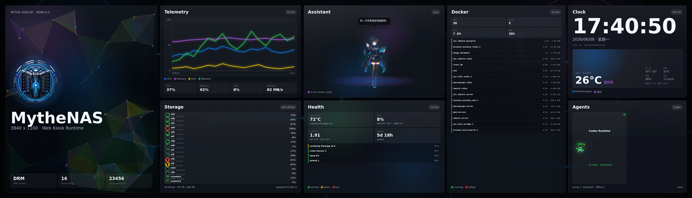
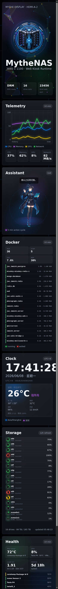

# Mythe Display

[中文说明](README.zh-CN.md)


Mythe Display is an open-source Ubuntu kiosk runtime for long, narrow secondary screens mounted on servers, NAS boxes, or desktop cases. It runs a local fullscreen Web UI on an HDMI/DisplayPort screen without requiring a full Ubuntu desktop environment.

The current release keeps the implementation intentionally simple: a static Web kiosk page, Python runtime collectors, a theme resource pack, and a small `mdp` command for service and page control. It is designed to be easy to reproduce, inspect, and customize.



## Features

- Fullscreen Web kiosk for Ubuntu systems without a desktop session.
- Tested on an HDMI long-bar display at `3840x1100`.
- Static Web UI served from `public/kiosk-test/`.
- Runtime JSON snapshots for FAIO listening rooms, disks, CPU, memory, GPU, network, health, Docker, Shenzhen weather, and local Codex session metadata.
- Read-only FAIO listening-room widget with cover art, lyrics, queue, and local NAS audio playback.
- Dynamic URL switching and reload through Chromium DevTools via `mdp`.
- Theme resource packs with semantic tokens, wallpaper layers, hero artwork, mascot assets, and pixel Agent sprites.
- Compact standard widgets for NAS-style monitoring.
- Local Codex skill files that help agents customize themes and widgets safely.

## Current Implementation

The current runtime is a release-ready static kiosk prototype, not yet a React/TypeScript component package. The project intentionally preserves this architecture for the first release because it is reliable on a headless NAS and avoids a framework migration before the core display workflow is stable.

Implemented today:

- `cage + Chromium` kiosk launcher for direct DRM display.
- Python static server and runtime collectors.
- `mdp` command for start, reload, switch, status, logs, theme, and pet import workflows.
- `core.faioListenRoom`, `core.systemHero`, `core.clockWeather`, `core.telemetryTrend`, `core.systemHealth`, `core.diskMatrix`, `core.dockerTui`, and `core.mascotAssistant` prototypes.
- Default `neon-dark` theme resource pack.

Future roadmap:

- Component package layout with typed manifests and schemas.
- React/TypeScript frontend runtime.
- Plugin-managed widgets and data providers.
- Additional display adapters beyond normal HDMI/DisplayPort screens.

## Project Structure

| Path | Purpose |
| --- | --- |
| `public/kiosk-test/` | Current static kiosk Web UI and mock data. |
| `public/themes/` | Theme resource packs. |
| `public/brand/` | Public brand assets used by docs and releases. |
| `scripts/` | Kiosk launcher, `mdp`, runtime collectors, display tests, and import helpers. |
| `systemd/` | Service template rendered by the installer. |
| `docs/` | Research, ADRs, interface specs, runtime control, and roadmap. |
| `examples/` | Public screenshots and examples referenced by README files. |
| `.codex/skills/mythe-display/` | Local Codex skill for project-aware customization. |

## Hardware Requirements

Recommended:

- Ubuntu server or desktop installation.
- HDMI or DisplayPort screen connected as a normal display.
- Intel/AMD/NVIDIA GPU with DRM/KMS support.
- Long-bar display such as `3840x1100`, though the Web UI can be previewed at other sizes.

For USB display output:

- A normal USB-C data port cannot become a native video output through software.
- USB-C video requires DP Alt Mode, USB4, or Thunderbolt support in hardware.
- DisplayLink USB adapters are possible but require separate Linux driver support and are not the default path.

## Quick Start

Install runtime dependencies:

```bash
sudo apt update
sudo apt install cage chromium-browser python3
```

Clone the repository and preview in a browser:

```bash
git clone <repo-url> mythe-display
cd mythe-display
python3 scripts/serve-web-test.py --host 0.0.0.0 --port 23456
```

Open:

```text
http://<server-ip>:23456/kiosk-test/
```

Generate runtime snapshots once:

```bash
scripts/collect-runtime-snapshots.py --once --pretty
```

Run the kiosk directly on a headless NAS:

```bash
sudo MYTHE_DISPLAY_PORT=23456 scripts/run-kiosk-web-test.sh
```

## Install as a Service

Install the systemd service and `mdp` command:

```bash
sudo scripts/install-kiosk-service.sh
```

The installer renders `systemd/mythe-display-kiosk.service` with the current checkout path, so the repository can live outside `/opt` or a user-specific home directory.

Start and enable the display:

```bash
mdp start
mdp enable
```

Common commands:

```bash
mdp status
mdp logs
mdp reload
mdp switch /kiosk-test/
mdp restart
```

Important behavior:

- `mdp reload` refreshes the current Chromium page only.
- `mdp restart` restarts the systemd service and reloads collector/script changes.
- Use `mdp restart` after changing runtime collector scripts or service environment variables.

## Configuration

Copy `.env.example` to `.env` for local-only overrides:

```bash
cp .env.example .env
```

The public template contains only non-secret defaults and empty placeholders. Never commit `.env`. The kiosk runner, installed systemd service, and `mdp` command read this file when it exists; explicitly exported shell variables still take priority for direct command runs.

Common environment variables:

- `MYTHE_DISPLAY_HOST`: local static server bind address.
- `MYTHE_DISPLAY_PORT`: static Web server port, default `23456`.
- `MYTHE_DISPLAY_REMOTE_DEBUG_HOST`: Chromium DevTools host, default `127.0.0.1`.
- `MYTHE_DISPLAY_REMOTE_DEBUG_PORT`: Chromium DevTools control port, default `23458`.
- `MYTHE_DISPLAY_BROWSER`: browser command, such as `chromium-browser`.
- `MYTHE_DISPLAY_DRM_DEVICE`: DRM card used by Cage/wlroots, default `auto` to select the card with a connected display connector.
- `MYTHE_DISPLAY_DRM_DEVICE_STRICT`: set to `1` to force the configured DRM card even when another card owns the connected display.
- `MYTHE_DISPLAY_DISABLE_DRM_ATOMIC`: set to `1` to use wlroots legacy DRM commits, default `1` for long-bar display stability.
- `MYTHE_DISPLAY_DISABLE_DRM_MODIFIERS`: set to `1` to disable DRM modifiers, default `1` for compatibility.
- `MYTHE_DISPLAY_DISABLE_RUNTIME_COLLECTOR`: set to `1` to disable runtime JSON collectors.
- `MYTHE_DISPLAY_FAIO_LISTEN_ROOM_URL`: FAIO room URL, default `http://127.0.0.1:4173/listen/XatSqhcP6LmROQyKrjCULXyD-zcynwRZO5QaLO5Oeyg`.
- `MYTHE_DISPLAY_FAIO_LISTEN_DISPLAY_NAME`: read-only room participant name, default `MytheNAS`.
- `MYTHE_DISPLAY_FAIO_LISTEN_REFRESH_MS`: FAIO room snapshot refresh interval, default `10000`.
- `MYTHE_DISPLAY_CODEX_AGENT_SHOW_THREAD_NAMES`: set to `1` only if showing Codex thread titles on the screen is acceptable.

## Runtime Data

The default page reads local JSON snapshots from `public/runtime/`. That directory is ignored by Git.

| Snapshot | Default refresh | Collector |
| --- | ---: | --- |
| `/runtime/disks.json` | 12 hours | `scripts/collect-disk-snapshot.py` |
| `/runtime/telemetry.json` | 10 minutes | `scripts/collect-telemetry-snapshot.py` |
| `/runtime/docker.json` | 10 minutes | `scripts/collect-docker-snapshot.py` |
| `/runtime/weather-shenzhen.json` | 30 minutes | `scripts/collect-weather-snapshot.py` |
| `/runtime/codex-agents.json` | 5 minutes | `scripts/collect-codex-agents-snapshot.py` |
| `/runtime/faio-listen.json` | 10 seconds | `scripts/collect-faio-listen-snapshot.py` |

Run all collectors once:

```bash
scripts/collect-runtime-snapshots.py --once --pretty
```

For local verification without touching the default runtime directory:

```bash
scripts/collect-runtime-snapshots.py --once --pretty --runtime-dir tmp/verify-runtime
```

Run the continuous collector loop:

```bash
scripts/collect-runtime-snapshots.py
```

## Theme Customization

The default theme lives in:

```text
public/themes/neon-dark/
```

A theme pack includes:

- `theme.json` semantic tokens and asset references.
- `backgrounds/` wallpaper layers.
- `hero/` identity artwork.
- `mascot/` assistant artwork or optional Codex/Petdex assets.
- `sprites/` pixel Agent state images.

Create a new theme:

```bash
cp -R public/themes/neon-dark public/themes/my-theme
```

Preview it:

```text
http://<server-ip>:23456/kiosk-test/?theme=../themes/my-theme/theme.json
```

See [Theme Resource Pack](docs/development/theme-resource-pack.md) and [Theme System](docs/development/theme-system.md).

## Custom Widget Development

The first release uses static HTML/CSS/JS widgets inside `public/kiosk-test/index.html`. A future React/TypeScript runtime is planned, but the current customization path is:

1. Define or reuse a JSON snapshot shape.
2. Add a collector or data provider that writes to `public/runtime/<name>.json`.
3. Add preview mock data under `public/kiosk-test/`.
4. Render the widget in the kiosk page.
5. Document the data contract in `docs/development/interface-spec.md`.

Current widget contracts are documented in:

- [Interface Spec](docs/development/interface-spec.md)
- [Standard Widgets](docs/development/standard-widgets.md)
- [Pixel Agent Widget](docs/development/pixel-agent-widget.md)
- [Codex Agent Tracking](docs/development/codex-agent-tracking.md)

## Agent-Assisted Customization

This repository includes a local Codex skill:

```text
.codex/skills/mythe-display/SKILL.md
```

It helps agents understand this project and safely perform customization tasks such as:

- creating a new theme resource pack,
- adding a runtime collector,
- designing a widget data contract,
- updating screenshots and docs,
- keeping secrets out of Git.

## Developer Documentation

- [Documentation Index](docs/README.md)
- [Web Kiosk Runtime ADR](docs/decisions/0002-web-kiosk-runtime.md)
- [Headless Kiosk Feasibility](docs/development/headless-kiosk-feasibility.md)
- [Runtime Control](docs/development/runtime-control.md)
- [Plugin Extension Model](docs/development/plugin-extension-model.md)
- [Roadmap](docs/development/roadmap.md)

## Examples

Desktop long-bar screenshot:


Mobile/narrow preview:



## Contributing

Keep changes focused on the current static kiosk architecture unless a migration is explicitly planned. For user-visible behavior changes, update the English README, Chinese README, `CHANGELOG.md`, and any relevant files under `docs/`. Do not commit `.env`, runtime snapshots, local screenshots, cache folders, or private credentials.

Recommended checks before submitting:

```bash
python3 -m py_compile scripts/*.py
bash -n scripts/*.sh scripts/mdp
scripts/collect-runtime-snapshots.py --once --pretty --runtime-dir tmp/verify-runtime
git status --ignored --short
```

## Acknowledgements

Mythe Display is informed by several mature projects and ideas:

- [MagicMirror²](https://magicmirror.builders/) for modular display dashboards.
- [Grafana](https://grafana.com/) for panel contracts and dashboard thinking.
- [Netdata](https://www.netdata.cloud/) and [Glances](https://nicolargo.github.io/glances/) for system monitoring approaches.
- [lazydocker](https://github.com/jesseduffield/lazydocker) for compact Docker status density.
- Codex/Petdex-style sprite pets for mascot resource compatibility.

See [Open Source Options](docs/research/open-source-options.md) for the full research notes.

## License

MIT. See [LICENSE](LICENSE).
